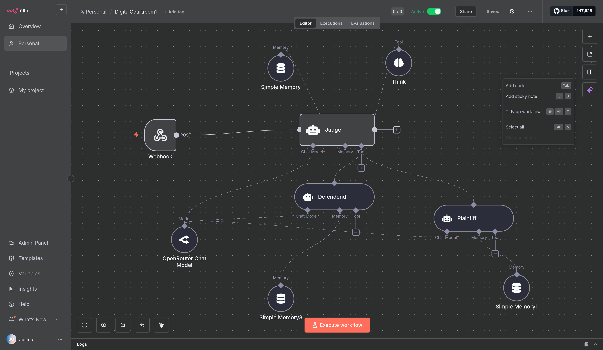

# Kanon

AI-powered legal strategy platform for case analysis, precedent research, and courtroom simulation.

## Overview

The platform assists defense attorneys in developing data-driven defense strategies through vector-based case search, AI strategy generation, and multi-agent courtroom simulations.

### Core Features

- PDF case document upload and text extraction
- Semantic similarity search using Weaviate vector database
- GPT-4 powered defense strategy generation
- Multi-agent courtroom simulations via n8n workflows
- Automated strategy evaluation and scoring
- Professional legal memorandum generation

## Architecture

**Backend**: Flask REST API with OpenAI integration, Weaviate client, and n8n webhook orchestration

**Frontend**: Next.js 14 with TypeScript, React, Tailwind CSS, and Radix UI components

**Database**: Weaviate vector database with OpenAI text-embedding-3-large

**Simulation Engine**: n8n workflows managing multi-agent trial simulations

## Prerequisites

### Backend
- Python 3.13+
- OpenAI API key
- Weaviate instance (cloud or local)
- n8n workflow deployment

### Frontend
- Node.js 18+
- npm

## Installation

### Backend Setup

```bash
# Create virtual environment
python3 -m venv venv
source venv/bin/activate

# Install dependencies
pip install -r requirements.txt

# Configure environment variables
cat > .env << EOF
OPENAI_API_KEY=your_key_here
WEAVIATE_URL=your_weaviate_url
WEAVIATE_API_KEY=your_weaviate_key
EOF

# Update config.yaml with Weaviate settings
```

### Frontend Setup

```bash
cd frontend
npm install

# Optional: Configure environment
echo "NEXT_PUBLIC_API_URL=http://localhost:5000" > .env.local
```

## Running the Application

### Start Backend
```bash
source venv/bin/activate
python app.py
# Runs on http://localhost:5000
```

### Start Frontend
```bash
cd frontend
npm run dev
# Runs on http://localhost:3000
```

## Data Setup

### Option 1: Use Pre-generated Data

The `data/` directory contains ready-to-use JSON files:
- `reckless_driving_cases.json` - Case database
- `judge_characteristics.json` - Judicial profiles
- `stateattorney_characteristics.json` - Prosecutor profiles

### Option 2: Generate from CourtListener API

```bash
conda activate hackathon
export COURTLISTENER_API_TOKEN=your_token

# Generate case data
python data/collection/CasesAPI.py
python data/collection/JudgeAPI.py
python data/collection/Syllabus.py
```

### Option 3: Load into Weaviate

```bash
# Configure config.yaml with collection settings
python backend/weaviate_cases.py --config config.yaml
```

## API Endpoints

### Case Management

**GET** `/api/similar-cases`
Returns top 5 similar cases from database

**POST** `/api/upload-case`
Upload PDFs, extract text, search for similar cases
- Body: `multipart/form-data` with `files[]`
- Returns: Array of similar cases with metadata

### Strategy Generation

**POST** `/api/generate-strategies`
Generate 3 defense strategies from selected cases
- Body: `{ "cases": [...] }`
- Returns: Array of strategy objects with advantages, considerations, risks

### Simulation

**POST** `/api/run-simulations`
Run parallel courtroom simulations for strategies
- Body: `{ "strategies": [...], "caseFacts": "...", "extractedText": "..." }`
- Returns: Server-Sent Events stream with results
- Executes 3 strategies in parallel using 3 n8n webhooks

### Report Generation

**POST** `/api/generate-memorandum`
Generate legal memorandum from simulation results
- Body: `{ "simulationResults": [...], "caseFacts": "..." }`
- Returns: Formatted legal memorandum text

### Health Check

**GET** `/health`
Server health status

## Simulation System



### n8n Payload Format

```json
{
  "session_id": "session-uuid",
  "judge_name": "Hon. Sarah Mitchell",
  "plaintiff_attorney_name": "James Anderson",
  "defense_attorney_name": "Defense Attorney",
  "case_facts": "...",
  "defense_strategy": [{
    "id": "strategy-1",
    "title": "Strategy Title",
    "concept": "Strategy concept",
    "advantages": ["..."]
  }],
  "stages": [
    "openings_plaintiff",
    "openings_defense",
    "state_case_in_chief",
    "defense_case_in_chief",
    "rebuttal_state",
    "surrebuttal_defense",
    "closings_plaintiff",
    "closings_defense",
    "verdict_judge"
  ]
}
```

### n8n Response Format

Expected array of stage objects:

```json
[
  {
    "session_id": "...",
    "stage": "openings_plaintiff",
    "speaker": "Plaintiff",
    "summary_of_record": "...",
    "argument": "...",
    "theory_of_case": "...",
    "verdict": null
  },
  {
    "session_id": "...",
    "stage": "verdict_judge",
    "speaker": "Judge",
    "summary_of_record": "...",
    "verdict": {
      "liable": false,
      "damages": "",
      "reasoning": "..."
    }
  }
]
```

The backend parses this from either the `output` field or `intermediateSteps.observation` fields.

### Parallel Execution

Three n8n webhook URLs enable parallel strategy testing:
1. `https://jukrebs.app.n8n.cloud/webhook/bfda8a16-0260-4297-ab36-a707e54323c2`
2. `https://jukrebs.app.n8n.cloud/webhook/21d18f0e-c74d-45cd-a753-a9b6e8e01744`
3. `https://jukrebs.app.n8n.cloud/webhook/f6a3c302-85e5-4ce5-a49f-4e210ed18ded`

Each strategy runs simultaneously on a different webhook, reducing total execution time from 15-20 minutes to 3-5 minutes.

### Scoring System

GPT-4o evaluates each simulation on a 0-10 scale:
- 0-2: Very Poor
- 3-4: Poor
- 5-6: Moderate
- 7-8: Good (counts as win)
- 9-10: Excellent (counts as win)

Evaluation includes: legal reasoning quality, precedent application, persuasiveness, response to opposition, strategic coherence, judge receptivity, outcome alignment.

## Configuration

### Judge Profile (`data/judge_characteristics.json`)
- Pleading strictness (0-10)
- Precedent weight (0-10)
- Policy receptivity (0-10)
- Plaintiff/defendant bias (0-10)
- Temperament and patience
- Areas of strict enforcement

### State Attorney Profile (`data/stateattorney_characteristics.json`)
- Aggressiveness level (0-10)
- Win rate percentage
- Communication style
- Settlement willingness
- Key strengths and weaknesses
- Tactical approaches

### Weaviate Configuration (`config.yaml`)
- Collection name and vectorizer
- Embedding model
- Search parameters
- Ingestion settings

## Project Structure

```
legal_strategy_platform/
├── app.py                    # Flask backend
├── config.yaml               # Weaviate configuration
├── requirements.txt          # Python dependencies
├── test_simulation.py        # Simulation testing
├── backend/
│   └── weaviate_cases.py    # Vector search client
├── data/
│   ├── collection/          # Data generation scripts
│   ├── judge_characteristics.json
│   ├── stateattorney_characteristics.json
│   └── reckless_driving_cases.json
└── frontend/
    ├── app/
    │   ├── (dashboard)/     # Application routes
    │   ├── api/            # API routes
    │   └── page.tsx        # Landing page
    ├── components/
    │   ├── layout/         # Layout components
    │   └── ui/             # UI component library
    └── lib/
        ├── types.ts        # TypeScript types
        └── utils.ts        # Utilities
```

## Testing

```bash
# Test simulation endpoint
python test_simulation.py

# Expected: 3 parallel simulations, streaming results, GPT-4o scoring
```

## Technology Stack

**Backend**: Flask, OpenAI GPT-4o, Weaviate, PyPDF, python-dotenv

**Frontend**: Next.js 14, React 18, TypeScript, Tailwind CSS, Radix UI, React Hook Form, Zod

**AI/ML**: GPT-4o (strategy generation & evaluation), text-embedding-3-large (vectorization), n8n (agent orchestration)

## Troubleshooting

**Backend won't start**
- Verify Python 3.13+: `python --version`
- Check virtual environment activation
- Verify dependencies: `pip install -r requirements.txt`

**OpenAI errors**
- Verify `OPENAI_API_KEY` in `.env`
- Check API credits and rate limits

**Weaviate connection errors**
- Verify `WEAVIATE_URL` and `WEAVIATE_API_KEY`
- Confirm collection exists (check `config.yaml`)

**n8n webhook errors**
- Verify workflows are deployed and active
- Check webhook URLs in `app.py` line 574-578
- Review n8n execution logs
- Increase `max_iterations` if agent stops early

**Frontend errors**
- Verify Node.js 18+: `node --version`
- Clear cache: `rm -rf node_modules .next && npm install`
- Check backend is running on port 5000

**No similar cases returned**
- Verify cases ingested into Weaviate
- Check collection name in config
- Review query generation in logs

## Performance

- Simulations run in parallel (3 simultaneous executions)
- Each simulation: 30-90 seconds depending on n8n workflow
- Total execution time: 3-5 minutes for 3 strategies
- Timeout: 300 seconds per simulation, 600 seconds queue timeout

## License

Proprietary software developed for legal strategy analysis.
